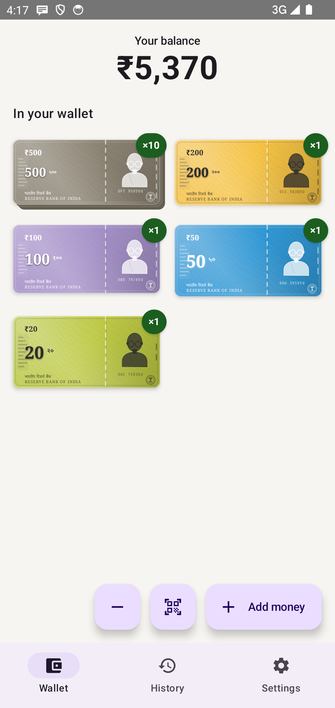
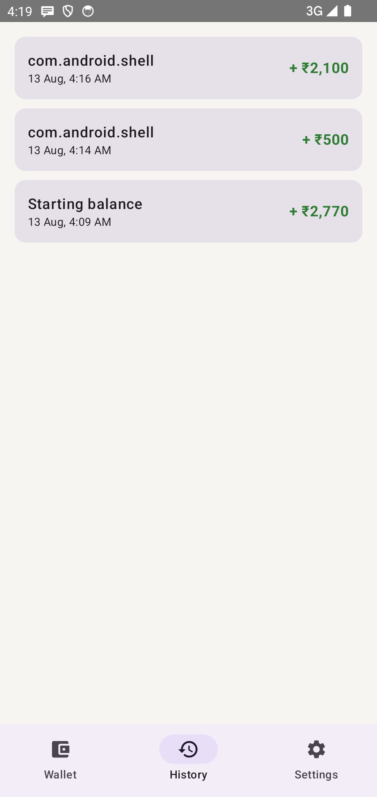
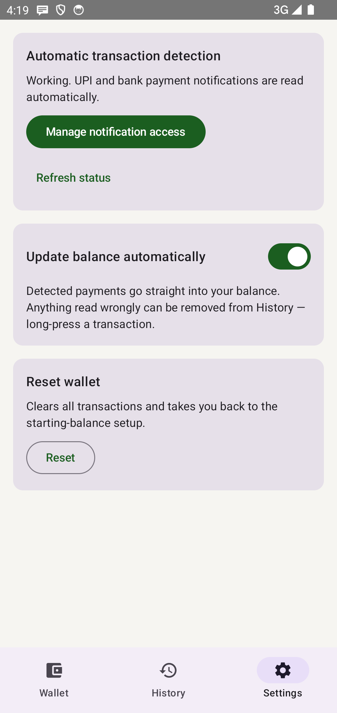

# CashSense

An Android app that shows your bank balance as Indian currency notes and coins, and makes them
fly out of the wallet as you spend — so UPI payments carry the same felt sense of depletion that
handing over cash used to.

Paying digitally is frictionless, which is exactly the problem: the money leaves without anything
marking its going. CashSense puts that back.

<p align="center">
  
  
  
</p>

## Install

Grab `app-release.apk` from the [latest release](https://github.com/Anoop1033/CashSense/releases/latest)
and open it on your phone. Android will ask you to allow installing from this source; that prompt is
normal for any app not delivered by a store.

Requires **Android 8.0 (API 26)** or newer.

After installing: finish onboarding, then go to **Settings → Grant notification access**. Without
it, only manual add/remove works — automatic detection needs to read payment notifications.

## How it works

1. **Onboarding** — enter your current balance once. It is broken into notes and coins with a
   greedy denomination algorithm (₹500, 200, 100, 50, 20, 10, 5, 2, 1; the ₹2000 note is excluded,
   RBI having withdrawn it in 2023).
2. **Detection** — `UpiNotificationListenerService` reads notifications and hands them to
   `TransactionTextParser`. Only payment apps, bank apps, and the carriers of bank alerts (your SMS
   and email apps) are read at all; everything else is discarded unexamined. Of what remains, a
   message counts only if a rupee amount sits *beside* a transaction verb — the proximity rule is
   what stops a marketing email's price pairing with an unsubscribe footer's "sent to".
3. **Applied, with a way back** — a reading that corroborates itself (quotes the bank's UPI
   reference, or names the account, or came from a payment app) goes straight into the balance.
   Anything less waits on the Wallet screen to be confirmed, so a misread can only ever ask, never
   move money silently. Auto-apply can be turned off in Settings, and anything wrong can be removed
   from History with a long press.
4. **One payment, once** — the same payment is announced by your bank's SMS, its email, and your
   UPI app. They are collapsed into a single transaction by matching the bank's own UPI reference
   number, with a short amount-and-time fallback for the apps that quote no reference.
5. **Visual wallet** — the wallet redraws after every change and animates the denominations that
   moved: outgoing notes lift away from the top, incoming ones drop in from below. Anything that
   happened while the app was closed is replayed when you next open it, so it is *seen*.

## Privacy

CashSense declares **no `INTERNET` permission**. Not a promise not to send your data — it has no
ability to send anything anywhere. No account, no sign-up, no cloud, no analytics, no ads, no
trackers. Transactions live in a private on-device database and are deleted when you reset the
wallet or uninstall.

It has no connection to your bank and never asks for credentials, card numbers, PINs or OTPs. It
only reads notifications your bank already sent to your own phone.

Full policy: [docs/privacy-policy.html](docs/privacy-policy.html).

## Building

Needs JDK 17 and the Android SDK (API 36). Everything else the Gradle wrapper fetches.

```sh
./gradlew testDebugUnitTest    # 65 unit tests, no device needed
./gradlew assembleRelease      # signed APK, if keystore.properties is present
./gradlew bundleRelease        # AAB for Play
```

Release signing reads `keystore.properties` from the project root, which is git-ignored along with
the keystore itself. Without it the release build still succeeds, just unsigned.

## Project layout

```
app/src/main/java/com/cashsense/app/
  domain/     DenominationBreakdown (greedy algorithm), TransactionTextParser — pure, unit-tested
  data/       Room entities/DAO/DB, DataStore prefs, WalletRepository (dedup lives here)
  service/    UpiNotificationListenerService
  ui/         onboarding/, home/ (wallet visual + view model), history/, settings/, navigation/, theme/
app/src/test/ JUnit tests for parsing and duplicate handling
store/        Play Store listing copy and graphics
```

## Known limitations

- Parsing notification text is inherently heuristic. It is deliberately narrow, and the tests are
  built from real HDFC, SBI and UPI-app wordings plus the false positives that actually bit (a
  Spotify advert read as a ₹799 payment; a WhatsApp message read as a ₹211 debit). Expect to extend
  `TransactionTextParser` against your own bank's phrasing.
- The balance is a running total from your starting figure, not a reading from your bank. India has
  no general balance API outside RBI's Account Aggregator framework, which is open only to
  regulated entities. If the two drift apart, correct it by hand.
- No backup or sync. Data is local, and uninstalling takes it with it.
- Note designs are stylised illustrations, not reproductions of currency. CashSense is not
  affiliated with the Reserve Bank of India or any bank.

## Licence

[GNU GPL v3](LICENSE). You are free to use, study, change and share it; derivatives must stay open
under the same terms. That last part is deliberate for an app whose selling point is that it sends
nothing anywhere — it keeps anyone from repackaging it with trackers bolted on.
